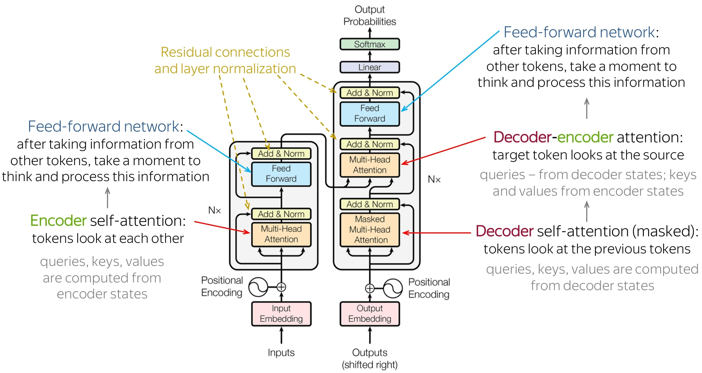

<!-- Include an image -->

# Transformer Architecture

The Transformer architecture consists of three parts:

1. **Encoder**: This is the encoder part of the model. The encoder is a stack of self-attention layers. The encoder is responsible for encoding the input sequence.

<!--  -->

2. **Decoder**: This is the decoder part of the model. The decoder is a stack of self-attention layers. The decoder is responsible for decoding the input sequence.

3. **Output Layer**: This is the output layer of the model. The output layer is a single fully-connected layer. The output layer is responsible for predicting the next word in the sequence.
